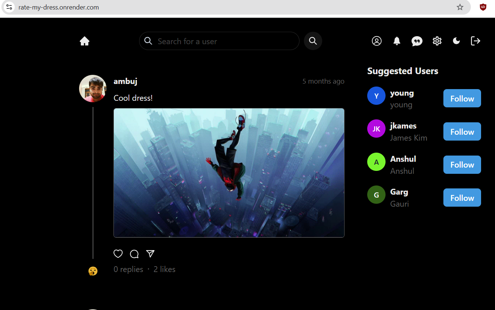
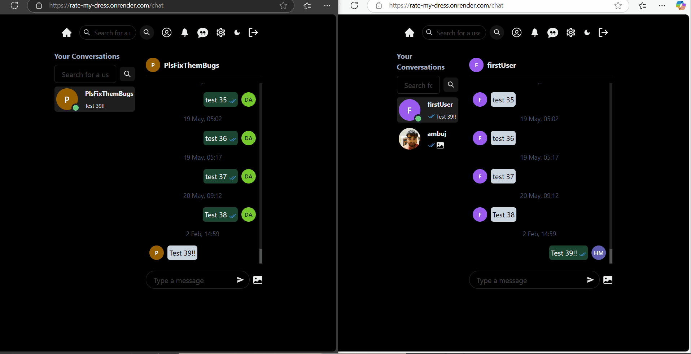

# Rate My Dress

## 📌 Overview

Rate My Dress is a stylish web app where users can upload and rate outfits. Whether you're looking for fashion advice or just want to showcase your style, this platform lets you get instant feedback from the community.

## Live Demo 🚀

[Try it now](https://rate-my-dress.onrender.com/)

## 📷 Screenshot

## 🎥 Realtime Chat Demo GIF

## ✨ Features

- 📸 Upload outfit photos & engage with likes, comments, and shares
- 👥 User authentication & profile customization
- 🔔 Get notified when someone starts following you, likes your post, or comments on them
- ❄️ Temporarily freeze your account
- 🔎 Search for users effortlessly
- 💬 Real-time chat with the ability to:
  - 📸 Send images instantly
  - 🔔 Receive notifications when away from the keyboard
  - ⌨️ See if the other person is typing
  - 🟢 See if the other person is online
  - ✅ Blue tick when the other person has read your message

## 🔧 Tech Stack

### **Frontend:**

- React.js
- JavaScript
- Tailwind CSS & Chakra UI
- Recoil (State Management)

### **Backend:**

- Node.js & Express.js
- JavaScript
- MongoDB (Mongoose ORM)
- Redis (Caching and Rate Limiting)

### **Real-Time Functionality:**

- Socket.IO (WebSockets for Live Collaboration)

## 🛠 Contributing

Contributions are welcome! Feel free to fork this repository, make improvements, and submit a pull request.

## 📜 License

This project is licensed under the MIT License.

## 📬 Contact

For any issues or feature requests, please open an issue on GitHub.
